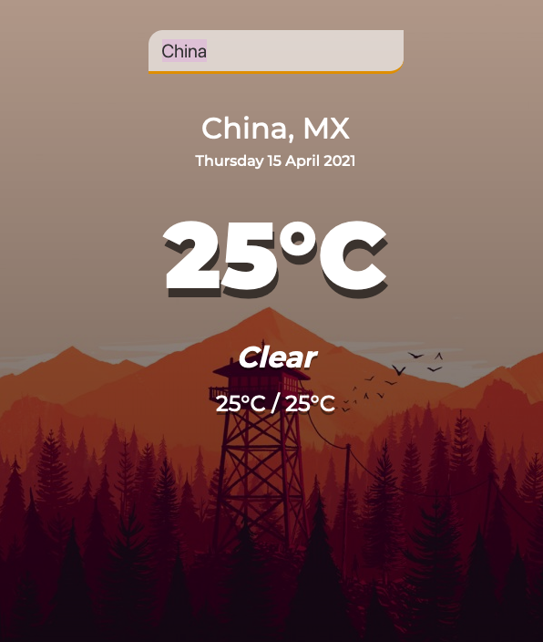

# WeatherApp

To better understand and for doing more practices about API I followed tutorial on Youtube:

- [For Weather App JS Tutorial](https://www.youtube.com/watch?v=n4dtwWgRueI&t=3s)

### WeatherApp - JS version:

---

[Click to see](https://ayerdelen.github.io/WeatherApp/weatherapp-JS)

---

### WeatherApp - React version: (Upcoming)
